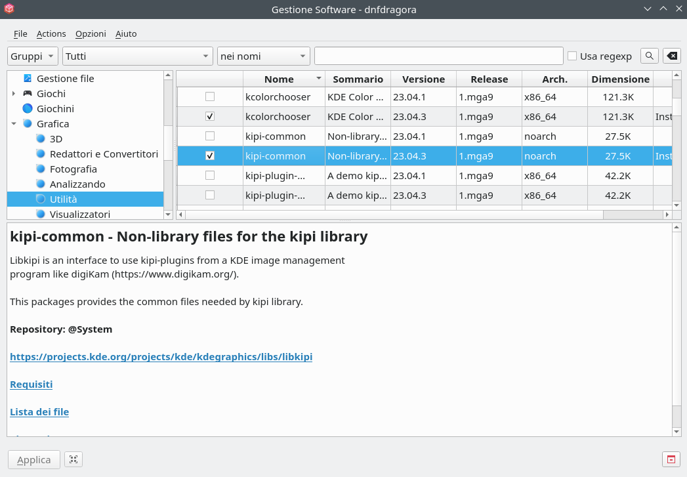
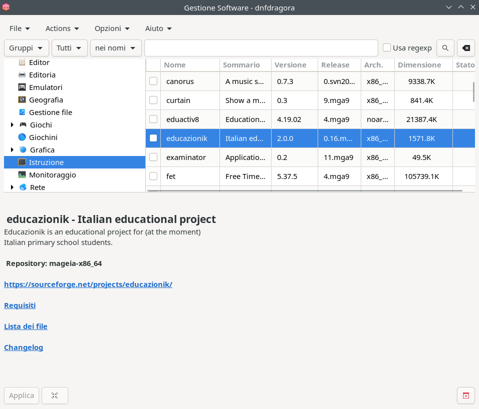
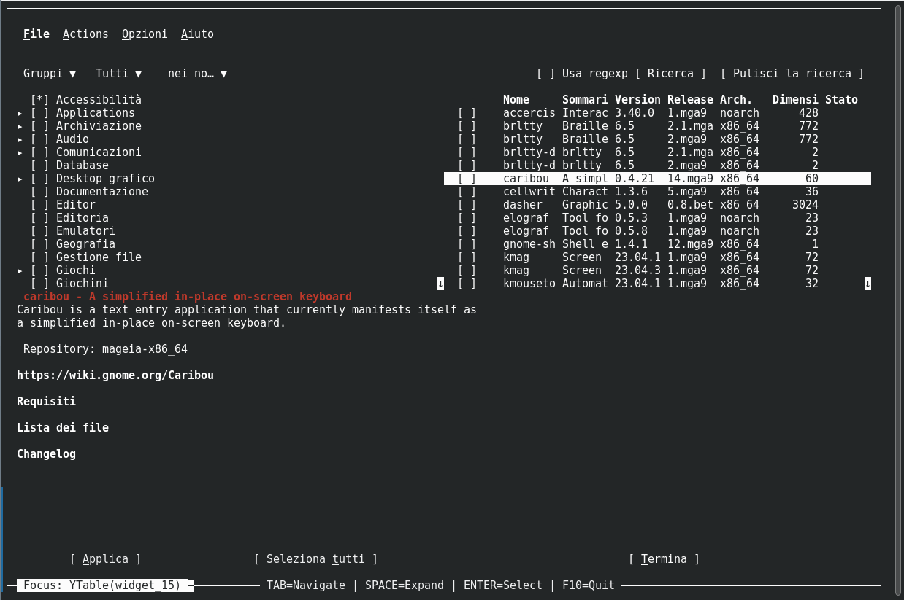

# dnfdragora 
 dnfdragora is a [DNF](http://dnf.readthedocs.io/en/latest/) frontend, based on rpmdragora from Mageia (originally rpmdrake) Perl code.

dnfdragora is written in Python 3 and uses [manatools.aui](https://github.com/manatools/python-manatools), the widget abstraction layer from python-manatools, so that it can be run using Qt (PySide6), GTK 4, or ncurses interfaces.

Example with Qt:

Example with GtK:

Example with ncurses:

## REQUIREMENTS

### DNF5 Daemon (dnf5daemon-server) >= 5.2.7
* https://github.com/rpm-software-management/dnf5
* Provides the D-Bus service `org.rpm.dnf.v0` used by dnfdragora.

### libdnf5 Python bindings
* Included in the DNF5 distribution.
* Required when `use_comps` is enabled (group metadata loading via `libdnf5.comps`).

### python-manatools >= 0.99.2
* https://github.com/manatools/python-manatools
* Provides `manatools.aui` (the UI abstraction layer) and `manatools.ui` (common dialogs and helpers).

### At least one of the manatools.aui UI backends
* **Qt** — requires PySide6 (`python3-pyside6`)
* **GTK** — requires PyGObject with GTK 4 (`python3-gobject`, `gtk4`)
* **ncurses** — requires the standard `curses` module (included with Python)

### dbus-python
* Required for D-Bus communication with dnf5daemon.

## PACKAGING AND TESTING NOTE — Tray / dnfdragora-update

- The `dnfdragora-update` helper (installed as `dnfdragora-updater`) uses the platform system tray using the Qt's `QSystemTrayIcon`, therefore the Qt Python bindings (`PySide6`) must be available at runtime. Unfortunately at the time we write this we did not find any Gtk4 implementations for system tray icon.
- Packagers: if `dnfdragora-update` or any split packaging includes the updater/tray helper as a separate package, declare a runtime dependency on PySide6 (distribution package commonly named `python3-pyside6`) so the tray icon and updater features work correctly.
- Users: on systems without a system tray (some Wayland sessions or minimal desktop environments) tray functionality may be limited or unavailable; `dnfdragora` will continue to run without the tray, but tray-specific updater notifications and controls will be disabled.

## INSTALLATION

### Distribution packages:
* Mageia:
    * dnfdragora: `dnf install dnfdragora` or `urpmi dnfdragora`
    * dnfdragora-gui: `dnf install dnfdragora-<gui>` or `urpmi dnfdragora-<gui>`
        * Replace `<gui>` with `qt` or `gtk` depending on desired toolkit
* Fedora:
    * dnfdragora:     `dnf install dnfdragora`     (installs all needed for use on terminal)
    * dnfdragora-gui: `dnf install dnfdragora-gui` (installs all needed for use in desktop environment)

### From sources:
* Packages needed to build:
    * cmake >= 3.4.0
    * python3-devel >= 3.4.0
    * optional: gettext        (for locales)
    * optional: python3-sphinx (for manpages)
* Configure: `mkdir build && cd build && cmake ..`
    * `-DCMAKE_INSTALL_PREFIX=/usr`     — Sets the install path, e.g. /usr, /usr/local or /opt
    * `-DCHECK_RUNTIME_DEPENDENCIES=ON` — Checks if the needed runtime dependencies are met.
    * `-DENABLE_COMPS=ON`               — Useful if your distribution uses COMPS for groups (Fedora, RHEL, CentOS)
* Build:     `make`
* Install:   `make install`
* Run:       `dnfdragora`

### From sources (for developers and testers only):
* Packages needed to build:
    * cmake >= 3.4.0
    * python3-devel >= 3.4.0
    * python3-virtualenv
    * optional: gettext        (for locales)
    * optional: python3-sphinx (for manpages)
* Setup your virtual environment
    * `cd $DNFDRAGORA_PROJ_DIR`                          — DNFDRAGORA_PROJ_DIR is the dnfdragora project directory
    * `virtualenv --system-site-packages venv`           — create virtual environment under venv directory
    * `. venv/bin/activate`                              — activate virtual environment
    * `pip install python-manatools`                     — install python-manatools (or install from sources)
* Configure and install: `mkdir build && cd build && cmake -D... .. && make install`
    * Required cmake options:
        * `-DCMAKE_INSTALL_PREFIX=$DNFDRAGORA_PROJ_DIR/venv`              — venv install prefix
        * `-DCMAKE_INSTALL_FULL_SYSCONFDIR=$DNFDRAGORA_PROJ_DIR/venv/etc` — venv sysconfig directory
    * Useful cmake options:
        * `-DCHECK_RUNTIME_DEPENDENCIES=ON` — checks runtime dependencies
        * `-DENABLE_COMPS=ON`               — enables COMPS group support (Fedora, RHEL, CentOS)
* Run `dnfdragora` inside the virtual environment:
    * `--locales-dir`  — test localization locally
    * `--images-path`  — local icons and images (set to `$DNFDRAGORA_PROJ_DIR/venv/share/dnfdragora/images/`)

## CONTRIBUTE

ManaTools and dnfdragora developers (as well as some users and contributors) are on Matrix. They often discuss development issues there
to get immediate feedback and develop ideas. The Matrix room is [`#manatools:matrix.org`](https://matrix.to/#/!manatools:matrix.org).
The Matrix room is also bridged to the IRC channel `#manatools` on Libera Chat. Get in touch with us!

If you have any issues or ideas add or comment an [issue](https://github.com/manatools/dnfdragora/issues).

Check also into our [TODO](TODO.md) file.

## LICENSE AND COPYRIGHT

See [license](LICENSE) file.
